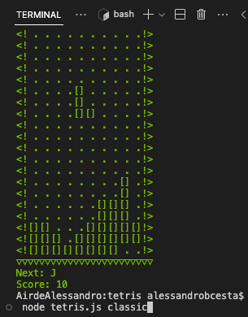
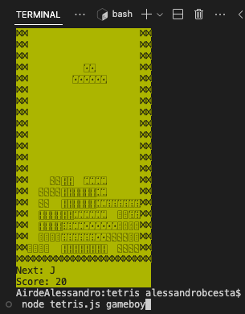
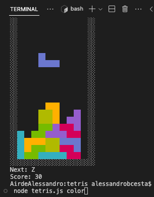

# tetris
<!--


-->


## 🚀 Projeto

*"When the right blocks come your way - and if you can manage to avoid mistakes - the game can be relaxing. One mislaid block, however, and your duties switch to damage control, a mad, panicky dash to clean up your mess or die!"*</br>
&nbsp; &nbsp; &nbsp;  [Electronic Gaming Monthly's, 100th issue](https://en.m.wikipedia.org/wiki/Electronic_Gaming_Monthly)

Um jogo de [Tetris](https://en.wikipedia.org/wiki/Tetris), inteiro em Javascript, usando a representação de texto de um terminal CLI como interface gráfica, inspirado pela [versão original de Tetris](https://en.wikipedia.org/wiki/Tetris#History) desenvolvida por [Alexey Pajitnov](https://en.wikipedia.org/wiki/Alexey_Pajitnov) em 1985.

<div align="center">
    
    
    
</div>

## 🛠️ Tecnologias
- [Node.js](https://nodejs.org/en/)
- [Javascript](https://developer.mozilla.org/pt-BR/docs/Web/JavaScript)

## 🧊 Cool features:
Personalize o jogo de acordo com sua plataforma favorita!
- <code>classic</code>: Versão original do jogo, desenvolvida para o [Electronika 60](https://en.wikipedia.org/wiki/Electronika_60).
- <code>gameboy</code>: Versão para o [console portátil da Nintendo](https://tetris.wiki/Tetris_(Game_Boy)), de 1989.
- <code>color</code>: Versão colorida do jogo.

## 🗂️ Utilização

### 🐑🐑 Clonando o repositório:

```bash
  $ git clone url-do-projeto.git
```

### ▶️ Rodando o App:

```bash
  $ cd tetris               # change to this directory
  $ node tetris.js          # run the script (default mode: classic), or:
  $ node tetris.js color    # run the script (modes: classic, gameboy, color)
```

### 🎮 Controles:

```bash
  [←]: Move para esquerda
  [→]: Move para direita
  [↓]: Move para baixo
  [↑]: Rotaciona sentido horário (↻)
  [D]: Rotaciona sentido horário (↻)
  [A]: Rotaciona sentido anti-horário (↺)
  CTRL + C: Finaliza o jogo
```

## ⭐ Like, Subscribe, Follow
Curtiu o projeto? Marque esse repositório com uma Estrela ⭐!
