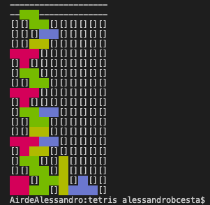

# tetris

## 🚀 Projeto
🚧 Em construção 🚧
<div align="center">
    
</div>

## 🗂️ Utilização

### 🐑🐑 Clonando o repositório:

```bash
  $ git clone url-do-projeto.git
```

### ▶️ Rodando o App:

```bash
  $ cd tetris
  $ node tetris.js    # run the script
```